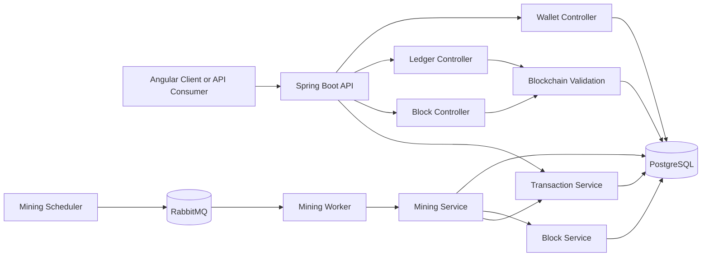
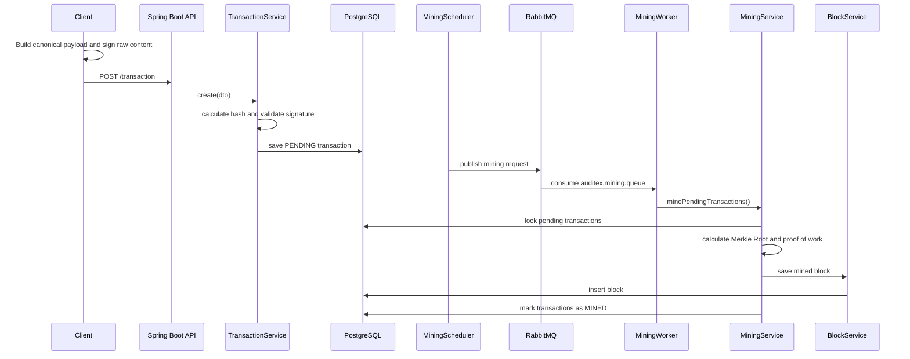
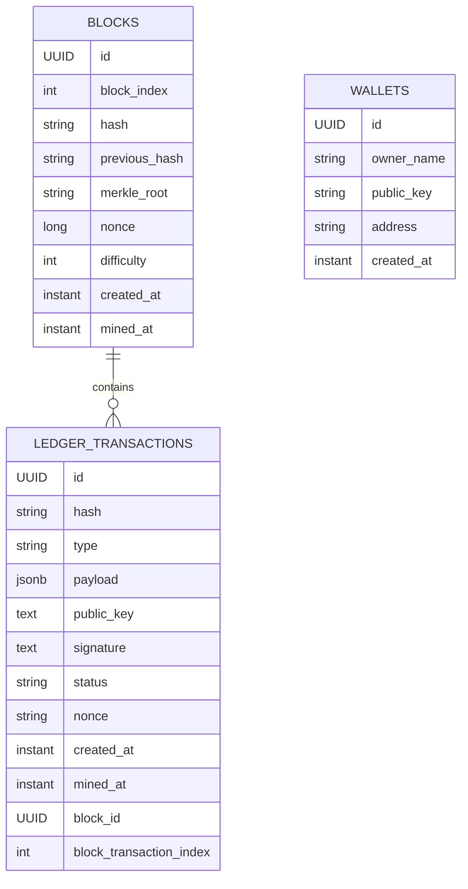

# Auditex — Financial Audit Ledger

Auditex is a Spring Boot backend for an auditable financial ledger built as a centralized, tamper-evident blockchain.

It receives signed financial events, stores them as ledger transactions, mines pending transactions into blocks, calculates Merkle Roots, applies proof of work, validates the complete chain, and exposes APIs to inspect transactions, blocks, wallets, and ledger health. PostgreSQL is used for durable persistence, including JSONB event payloads, and RabbitMQ drives the asynchronous mining pipeline.

The project is intentionally not a cryptocurrency and not a decentralized blockchain. It models a financial audit trail where a trusted backend maintains an append-only ledger while cryptographic hashes, signatures, Merkle Trees, previous-hash links, and full-chain validation make silent mutation detectable.

## Why This Exists

Financial systems need durable, inspectable audit trails for events such as received files, batch processing, charge calculation, divergences, approvals, rejections, exports, and other critical workflow transitions.

Traditional audit tables are useful, but they can be hard to verify after the fact if historical rows are altered directly. Auditex addresses that by turning financial workflow events into signed ledger transactions and grouping them into tamper-evident blocks. Any mutation to a mined transaction, block metadata, Merkle Root, proof-of-work hash, or previous-hash link is detectable through the validation API.

## Core Features

| Area | Implemented capability |
| --- | --- |
| Transaction ingestion | `POST /transaction` accepts signed event payloads with `type`, `payload`, `publicKey`, `signature`, and `nonce`. |
| Signature model | RSA `SHA256withRSA` verification using the submitted public key. |
| Replay protection | Unique `(public_key, nonce)` constraint and validation checks. |
| Transaction hashing | SHA-256 over `type + canonicalPayload + publicKey + nonce`. |
| JSONB payloads | Transaction payloads are persisted as PostgreSQL `jsonb`. |
| Financial filtering | Native JSONB queries for `payload ->> 'processingId'` and `payload ->> 'fileHash'`. |
| Async mining | A scheduled publisher emits RabbitMQ mining requests every 5 seconds after an initial 1 second delay. |
| Mining worker | `@RabbitListener` consumes `auditex.mining.queue` and delegates to `MiningService`. |
| Block creation | Pending transactions are locked with `FOR UPDATE SKIP LOCKED`, mined, linked to a block, and marked as `MINED`. |
| Merkle Root | Built from transaction hashes, preserving deterministic block transaction order. |
| Proof of work | SHA-256 block hash must start with `difficulty` leading zeroes. Current default difficulty is `4`. |
| Batch policy | Up to 100 pending transactions per block; smaller batches are mined when pending transactions are older than 15 seconds. |
| Deterministic validation | `blockTransactionIndex` preserves transaction order for Merkle recomputation. |
| Full-chain validation | Checks block indexes, previous hashes, Merkle Roots, block hashes, proof of work, transaction hashes, signatures, status, block links, mined timestamps, transaction indexes, and duplicate nonces. |
| Paginated APIs | Transaction, block, and block-transaction APIs are paginated with a maximum page size of 100. |
| Immutability guards | JPA lifecycle checks reject updates to blocks and mined transactions. |
| Wallet support | Backend can generate RSA key pairs and ledger addresses; the Angular client encrypts private keys locally. |
| Frontend explorer | Angular client includes dashboard, ledger explorer, block explorer, transaction detail, event creation, and wallet flows. |

## Architecture Overview

Auditex is organized around small domain modules under `dev.joaopdias.auditex.core`: `transaction`, `block`, `mining`, `ledger`, and `wallet`. Shared hashing, signature, pagination, CORS, security, RabbitMQ, and exception handling live under `shared` and `config`.



## Transaction Lifecycle

1. A client creates a financial event payload.
2. The payload is serialized in canonical JSON order.
3. Raw content is built as `type + canonicalPayload + publicKey + nonce`.
4. The client signs the raw content with its private key.
5. The backend validates the signature using the submitted public key.
6. The backend calculates the transaction hash from the same raw content.
7. The transaction is stored as `PENDING`.
8. `MiningScheduler` publishes a RabbitMQ mining request.
9. `MiningWorker` consumes the message and calls `minePendingTransactions()`.
10. `MiningService` selects pending transactions with `FOR UPDATE SKIP LOCKED`.
11. The Merkle Root is calculated from ordered transaction hashes.
12. Proof of work searches for a valid block nonce.
13. The block is saved.
14. Transactions are marked as `MINED`.
15. `blockId`, `minedAt`, and `blockTransactionIndex` are assigned.
16. `/ledger/validate` or `/block/validate` can verify chain integrity.



## Blockchain Validation

The validation flow pages through blocks ordered by index and through each block's transactions ordered by `blockTransactionIndex`. It does not rely on in-memory `findAll()` for critical validation.

Validation checks:

- block index sequence starting from `0`;
- `previousHash` linkage, using the all-zero genesis previous hash for the first block;
- Merkle Root recomputed from actual persisted transaction hashes;
- block hash recomputed from `index + previousHash + merkleRoot + nonce + difficulty`;
- proof-of-work target based on leading zeroes;
- transaction status must be `MINED`;
- `blockId` must exist and match the block being validated;
- `minedAt` must exist;
- `blockTransactionIndex` must exist;
- transaction hash must match `type + canonicalPayload + publicKey + nonce`;
- RSA signature must verify against the reconstructed raw content;
- duplicate nonce usage per public key is detected.

Example response:

```json
{
  "valid": true,
  "blocksChecked": 2,
  "transactionsChecked": 4,
  "brokenAtBlock": null,
  "brokenAtTransaction": null,
  "reason": null
}
```

Known invalid `reason` values include `INVALID_BLOCK_INDEX`, `INVALID_PREVIOUS_HASH`, `INVALID_MERKLE_ROOT`, `INVALID_BLOCK_HASH`, `INVALID_PROOF_OF_WORK`, `INVALID_TRANSACTION_STATUS`, `MISSING_TRANSACTION_BLOCK_ID`, `INVALID_TRANSACTION_BLOCK_ID`, `MISSING_TRANSACTION_MINED_AT`, `MISSING_TRANSACTION_BLOCK_INDEX`, `INVALID_TRANSACTION_HASH`, `INVALID_TRANSACTION_SIGNATURE`, and `DUPLICATED_TRANSACTION_NONCE`.

## Financial Domain Model

The backend accepts arbitrary transaction `type` strings and arbitrary JSON payloads. The Angular client models the following financial event types:

| Type | Purpose |
| --- | --- |
| `BILLING_FILE_RECEIVED` | Records arrival of an input billing file. |
| `BILLING_FILE_VALIDATED` | Records file validation state. |
| `BILLING_PROCESSING_STARTED` | Records the beginning of a billing workflow. |
| `BILLING_PROCESSING_FINISHED` | Records completion metrics for a workflow. |
| `BILLING_CHARGE_CALCULATED` | Records calculated billing amounts. |
| `BILLING_DIVERGENCE_DETECTED` | Records financial or record-level mismatch details. |
| `BILLING_BATCH_APPROVED` | Records approval of a processed batch. |
| `BILLING_BATCH_REJECTED` | Records rejection of a processed batch. |
| `BILLING_REPORT_EXPORTED` | Records report/export generation. |

Common payload fields are not all mandatory at the backend level. The API only requires a non-null `payload`; the frontend requires `processingId` and `fileHash` before submitting a financial event.

| Field | Meaning |
| --- | --- |
| `processingId` | Correlation ID for a processing workflow. |
| `fileHash` | Hash of the source or generated file. |
| `fileName` | Human-readable file name. |
| `recordsCount` | Number of records received or expected. |
| `recordsProcessed` | Number of records processed. |
| `totalAmount` | Total monetary value involved in the event. |
| `currency` | Currency code, for example `BRL`. |
| `source` | Source system or pipeline. |
| `divergenceType` | Divergence category, for example `AMOUNT_MISMATCH`. |
| `expectedAmount` | Expected monetary value. |
| `actualAmount` | Actual observed monetary value. |
| `difference` | Difference between expected and actual values. |
| `affectedRecords` | Number of impacted records. |
| `divergencesFound` | Count of divergences found during processing. |
| `durationMs` | Processing duration in milliseconds. |
| `status` | Domain status such as `COMPLETED`, `APPROVED`, `REJECTED`, or `EXPORTED`. |

## Data Model



### Block

| Field | Notes |
| --- | --- |
| `id` | UUID primary key. |
| `index` | Stored as `block_index`; unique block sequence number. |
| `hash` | Unique SHA-256 block hash. |
| `previousHash` | Previous block hash; genesis previous hash is 64 zeroes. |
| `merkleRoot` | Merkle Root derived from transaction hashes. |
| `nonce` | Proof-of-work nonce. |
| `difficulty` | Number of leading zeroes required in the block hash. |
| `createdAt` | Set on persist. |
| `minedAt` | Set when the block is saved as mined. |

### LedgerTransaction

| Field | Notes |
| --- | --- |
| `id` | UUID primary key. |
| `hash` | Unique SHA-256 transaction hash. |
| `type` | Financial event type string. |
| `payload` | PostgreSQL JSONB payload. |
| `publicKey` | Base64 RSA public key. |
| `signature` | Base64 RSA signature. |
| `status` | `PENDING`, `PROCESSING`, `VALIDATED`, `REJECTED`, or `MINED`; mining currently uses `PENDING`, `PROCESSING`, and `MINED`. |
| `nonce` | Client-generated unique value per public key. |
| `createdAt` | Set on persist. |
| `minedAt` | Set when transaction is mined. |
| `blockId` | UUID of containing block. |
| `blockTransactionIndex` | Deterministic order within the block. |

## API Reference

Base URL locally: `http://localhost:8080`.

Pagination parameters:

| Parameter | Default | Limit |
| --- | --- | --- |
| `page` | `0` | must be `>= 0` |
| `size` | `20` for lists, `50` for block transactions | max `100` |

### Transactions

| Method | Path | Purpose |
| --- | --- | --- |
| `POST` | `/transaction` | Create a signed ledger transaction. |
| `GET` | `/transaction?page=0&size=20` | List transactions, newest first. |
| `GET` | `/transaction/{hash}` | Find by hash. |
| `GET` | `/transaction/hash/{hash}` | Explicit find by hash. |
| `GET` | `/transaction/public-key?publicKey=...&page=0&size=20` | Filter by public key. |
| `GET` | `/transaction/type/{type}?page=0&size=20` | Filter by event type. |
| `GET` | `/transaction/processing/{processingId}?page=0&size=20` | Filter by `payload.processingId` using JSONB. |
| `GET` | `/transaction/file/{fileHash}?page=0&size=20` | Filter by `payload.fileHash` using JSONB. |

Create request:

```json
{
  "type": "BILLING_FILE_RECEIVED",
  "payload": {
    "processingId": "ec8a7cd7-bac5-49cb-8a0f-d99102cd3b9f",
    "fileName": "billing_2026_05.csv",
    "fileHash": "sha256-do-arquivo",
    "recordsCount": 120000,
    "totalAmount": 1250000.75,
    "currency": "BRL",
    "source": "billing-pipeline"
  },
  "publicKey": "base64-x509-rsa-public-key",
  "signature": "base64-rsa-signature",
  "nonce": "6cf4c86b-5a92-4b96-873b-fc63df83efc7"
}
```

Create response:

```json
{
  "id": "c070149b-43fd-4d0a-a33f-83278e25e03b",
  "hash": "9b5f7b8e6dc6a9cbcd3dd79c3f9cf0668b0dbb2b25e04f25e3d91fa31b3c7a60",
  "type": "BILLING_FILE_RECEIVED",
  "payload": {
    "processingId": "ec8a7cd7-bac5-49cb-8a0f-d99102cd3b9f",
    "fileName": "billing_2026_05.csv",
    "fileHash": "sha256-do-arquivo",
    "recordsCount": 120000,
    "totalAmount": 1250000.75,
    "currency": "BRL",
    "source": "billing-pipeline"
  },
  "publicKey": "base64-x509-rsa-public-key",
  "signature": "base64-rsa-signature",
  "status": "PENDING",
  "nonce": "6cf4c86b-5a92-4b96-873b-fc63df83efc7",
  "createdAt": "2026-05-12T12:00:00Z",
  "minedAt": null,
  "blockId": null,
  "blockTransactionIndex": null
}
```

Paginated response shape:

```json
{
  "content": [],
  "page": 0,
  "size": 20,
  "totalElements": 0,
  "totalPages": 0,
  "first": true,
  "last": true
}
```

### Blocks

| Method | Path | Purpose |
| --- | --- | --- |
| `GET` | `/block?page=0&size=20` | List blocks ordered by index ascending. |
| `GET` | `/block/validate` | Validate the blockchain. |
| `GET` | `/block/latest` | Return the latest block. |
| `GET` | `/block/last` | Alias for latest block. |
| `GET` | `/block/id/{id}` | Find a block by UUID. |
| `GET` | `/block/hash/{hash}` | Find a block by hash. |
| `GET` | `/block/index/{index}` | Find a block by block index. |
| `GET` | `/block/{id}/transaction?page=0&size=50` | Return a block and its paginated transactions. |
| `GET` | `/block/{hash}` | Find a block by hash. |

Block response:

```json
{
  "id": "88c4fb49-43ec-4b38-8d9a-4d5ad3283a1a",
  "index": 0,
  "hash": "0000c33a4c6edb2460b8782d5e9e5bdf4f6c6a49560a25d4a72ffdf6f82d95a1",
  "previousHash": "0000000000000000000000000000000000000000000000000000000000000000",
  "merkleRoot": "9b5f7b8e6dc6a9cbcd3dd79c3f9cf0668b0dbb2b25e04f25e3d91fa31b3c7a60",
  "nonce": 49728,
  "difficulty": 4,
  "createdAt": "2026-05-12T12:00:30Z",
  "minedAt": "2026-05-12T12:00:30Z",
  "transactionsCount": 1
}
```

### Ledger

| Method | Path | Purpose |
| --- | --- | --- |
| `GET` | `/ledger/status` | Aggregate ledger status and latest block metadata. |
| `GET` | `/ledger/validate` | Validate the blockchain through the ledger facade. |

Status response:

```json
{
  "valid": true,
  "blocksCount": 12,
  "pendingTransactions": 1,
  "minedTransactions": 842,
  "latestBlockIndex": 11,
  "latestBlockHash": "0000e72a5d4d0b1f5e9f5b95e7c4c75d62a7f1d6f7bd297d26894683e4f5a111",
  "lastMinedAt": "2026-05-12T12:15:00Z"
}
```

### Wallets

| Method | Path | Purpose |
| --- | --- | --- |
| `POST` | `/wallet` | Generate an RSA wallet and persist its public identity. |

Request:

```json
{
  "ownerName": "Finance Ops"
}
```

Response:

```json
{
  "id": "f33af0f4-f27a-49e6-b510-40573dfc3127",
  "ownerName": "Finance Ops",
  "address": "AX-2e2c0efb1c63a1a02d0a54694c7b4c67",
  "publicKey": "base64-x509-rsa-public-key",
  "privateKey": "base64-pkcs8-rsa-private-key",
  "createdAt": "2026-05-12T12:00:00Z"
}
```

The backend returns the private key only at creation time. The Angular client encrypts it locally using PBKDF2 and AES-GCM before storing it in IndexedDB.

## Example Financial Payloads

`BILLING_FILE_RECEIVED`:

```json
{
  "processingId": "ec8a7cd7-bac5-49cb-8a0f-d99102cd3b9f",
  "fileName": "billing_2026_05.csv",
  "fileHash": "sha256-do-arquivo",
  "recordsCount": 120000,
  "totalAmount": 1250000.75,
  "currency": "BRL",
  "source": "billing-pipeline"
}
```

`BILLING_DIVERGENCE_DETECTED`:

```json
{
  "processingId": "ec8a7cd7-bac5-49cb-8a0f-d99102cd3b9f",
  "fileHash": "sha256-do-arquivo",
  "divergenceType": "AMOUNT_MISMATCH",
  "expectedAmount": 1250000.75,
  "actualAmount": 1249980.5,
  "difference": 20.25,
  "affectedRecords": 3
}
```

## Tech Stack

Backend:

- Java 25
- Spring Boot 4.0.6
- Spring Web MVC
- Spring Data JPA / Hibernate
- Spring Security with permissive development configuration
- Spring Validation
- Spring AMQP
- PostgreSQL 17
- RabbitMQ 4 management image
- Maven wrapper
- Docker and Docker Compose
- JUnit, Mockito, Spring MVC Test, Spring AMQP Test, Spring Data JPA Test

Frontend:

- Angular 21
- TypeScript 5.9
- RxJS
- SCSS
- Vitest through Angular unit-test builder
- IndexedDB wallet vault
- Web Crypto API for local private key encryption and transaction signing

## Local Setup

### Requirements

- Java 25
- Docker and Docker Compose
- Maven wrapper dependencies, fetched automatically by `mvnw`
- Node.js/Yarn if running the Angular client

### Backend with local PostgreSQL and RabbitMQ

Start infrastructure:

```bash
docker compose up -d db message-br
```

Run the backend:

```bash
bash ./mvnw spring-boot:run
```

The API runs on `http://localhost:8080`.

RabbitMQ Management runs on `http://localhost:15672` with username `user` and password `user`.

### Full Docker Compose

The compose file can build the server image:

```bash
docker compose up --build
```

Current compose note: the `server` service defines PostgreSQL environment variables but does not currently set `RABBITMQ_HOST=message-br` or wait for the RabbitMQ service. For a fully containerized backend + RabbitMQ run, add these environment values to `server`:

```yaml
RABBITMQ_HOST: message-br
RABBITMQ_PORT: 5672
RABBITMQ_USERNAME: user
RABBITMQ_PASSWORD: user
```

### Frontend

From the repository sibling directory:

```bash
cd ../client
yarn install
yarn start
```

The Angular app runs on `http://localhost:4200` and uses `http://localhost:8080` as `API_URL` in the development configuration.

## Environment Variables

| Variable | Default | Used by |
| --- | --- | --- |
| `PORT` | `8080` | Spring server port through `server.port=${PORT:8080}`. |
| `DATABASE_URL` | `jdbc:postgresql://localhost:5432/auditex` | JDBC URL. |
| `DATABASE_USERNAME` | `postgres` | Database username. |
| `DATABASE_PASSWORD` | `postgres` | Database password. |
| `JPA_DDL_AUTO` | `update` | Hibernate schema mode. |
| `JPA_SHOW_SQL` | `true` | SQL logging. |
| `JPA_FORMAT_SQL` | `true` | SQL formatting. |
| `SQL_INIT_MODE` | `never` | Spring SQL initialization mode. |
| `RABBITMQ_HOST` | `localhost` | RabbitMQ host. |
| `RABBITMQ_PORT` | `5672` | RabbitMQ port. |
| `RABBITMQ_USERNAME` | `user` | RabbitMQ username. |
| `RABBITMQ_PASSWORD` | `user` | RabbitMQ password. |
| `RABBITMQ_RETRY_ENABLED` | `true` | Listener retry toggle. |
| `RABBITMQ_RETRY_INITIAL_INTERVAL` | `1000` | Retry initial interval. |
| `RABBITMQ_RETRY_MAX_ATTEMPTS` | `3` | Max retry attempts. |
| `RABBITMQ_RETRY_MAX_INTERVAL` | `10000` | Retry max interval. |
| `RABBITMQ_RETRY_MULTIPLIER` | `2` | Retry multiplier. |
| `CLIENT_URLS` | `http://localhost:4200` | Semicolon-separated CORS allowed origins. |

The compose file also sets `SERVER_PORT`, but the application currently reads `PORT`.

## Testing

Backend:

```bash
bash ./mvnw test
```

The current backend suite covers:

- transaction creation, duplicate hash detection, duplicate nonce detection, invalid signatures, hash lookup, and pagination validation;
- repository JSONB filters by `processingId` and `fileHash`;
- mining batch policy, Merkle Root mining, proof-of-work behavior, and transaction state transitions;
- mining scheduler and RabbitMQ worker delegation;
- block creation, pagination, lookup, transaction listing, and full-chain validation failure modes;
- ledger status and validation facade;
- wallet creation and RSA key generation;
- hash and signature services;
- global exception mapping;
- entity immutability guards.

Frontend:

```bash
cd ../client
yarn test
```

The Angular project uses the Angular unit-test builder with Vitest.

## Design Decisions

**Centralized blockchain.** Auditex uses blockchain data structures without pretending to be decentralized. A financial platform can retain operational control while still making historical mutation evident through hashes, signatures, Merkle Roots, and chain validation.

**RabbitMQ-based mining pipeline.** Transaction ingestion stays fast: it validates and stores events as `PENDING`. Mining is triggered asynchronously by scheduled RabbitMQ messages and handled by a worker component.

**Asynchronous batch mining.** Blocks are mined when there are at least 100 pending transactions or when smaller pending batches age beyond 15 seconds. This balances latency and block density.

**Merkle Root per block.** The block commits to the transaction set without putting all transaction data into the block hash. Validation can recompute the root from persisted transactions.

**`blockTransactionIndex`.** The Merkle Root depends on transaction order, so the mined order is persisted explicitly and constrained uniquely per block.

**Full-chain validation.** Validation checks both block-level and transaction-level integrity instead of only checking previous hashes.

**PostgreSQL persistence.** PostgreSQL provides durable relational constraints, JSONB payload storage, native JSONB filters, and row-level locking through `FOR UPDATE SKIP LOCKED`.

**Paginated data access.** Block, transaction, and validation flows avoid loading the full ledger into memory. Public list APIs enforce a maximum page size of 100.

## Security and Integrity Model

- The backend validates signatures with `publicKey`; transaction signing is performed by the client.
- The transaction API never accepts a `privateKey`; it receives only the public key, signature, nonce, type, and payload.
- The backend wallet endpoint currently generates and returns a private key only during wallet creation.
- The Angular client stores private keys locally after encrypting them with PBKDF2-derived AES-GCM keys in IndexedDB.
- Transaction nonces prevent replay for the same public key through a unique database constraint.
- Transaction hashes detect mutation of type, payload, public key, or nonce.
- Merkle Roots detect mutation of transactions within a mined block.
- Previous-hash links connect blocks into a chain.
- Proof of work makes retroactive changes detectable because a modified block hash must still satisfy the configured target.
- JPA lifecycle guards reject changes to blocks and mined transactions through normal persistence flows.
- `/ledger/validate` and `/block/validate` recompute chain integrity from persisted data.

Development note: `SecurityConfig` currently permits all requests and disables CSRF, which is appropriate for a portfolio/demo API but should be hardened before production use.

## Performance and Scalability Considerations

- Public list APIs are paginated.
- Validation pages through blocks and transactions.
- Mining processes transactions in batches of up to 100.
- `FOR UPDATE SKIP LOCKED` prevents competing mining workers from selecting the same pending rows.
- Database indexes exist for transaction status, status + creation time, block ID, block ID + transaction index, public key, and public key + creation time.
- Unique constraints protect transaction hash, `(public_key, nonce)`, block hash, block index, and `(block_id, block_transaction_index)`.
- JSONB filters support workflow-oriented lookup by `processingId` and `fileHash`.
- Critical flows avoid unbounded `findAll()` usage.

## Project Structure

```text
server
├── compose.yaml
├── Dockerfile
├── pom.xml
├── src/main/java/dev/joaopdias/auditex
│   ├── AuditexApplication.java
│   ├── config
│   │   ├── CorsConfig.java
│   │   ├── RabbitMessageConfig.java
│   │   ├── RabbitMqConfig.java
│   │   ├── RabbitTemplateConfig.java
│   │   └── SecurityConfig.java
│   ├── core
│   │   ├── block
│   │   ├── ledger
│   │   ├── mining
│   │   ├── transaction
│   │   └── wallet
│   └── shared
│       ├── dto
│       ├── exceptions
│       └── services
└── src/test/java/dev/joaopdias/auditex
    ├── config
    ├── core
    └── shared

client
└── src/app
    ├── core
    ├── features
    │   ├── block
    │   ├── dashboard
    │   ├── ledger
    │   ├── transaction
    │   └── wallet
    └── shared
```

## Portfolio Highlights

- Event-driven backend architecture with RabbitMQ.
- Financial audit domain modeling with workflow correlation fields.
- Cryptographic signature validation with RSA.
- Tamper-evident blockchain-style data structures.
- Merkle Tree integrity checks.
- Proof-of-work block mining.
- PostgreSQL JSONB persistence and query filters.
- Full-chain validation across blocks and transactions.
- Paginated data access and validation loops.
- DTO-based API design.
- Angular dashboard/explorer and client-side wallet vault.

## Roadmap

Future work that would fit the current architecture:

- Merkle proof endpoint for a transaction within a block.
- Richer schema validation per financial event type.
- Audit report export.
- Admin explorer UI with deeper block and validation diagnostics.
- Dead-letter queue configuration for failed mining messages.
- Distributed lock or single-flight guard for multi-instance mining coordination.
- Explicit append-only database rules and migration-based schema management.
- Testcontainers integration for PostgreSQL and RabbitMQ integration tests.
- Production-grade observability with metrics, structured logs, and tracing.
- Hardened authentication and authorization for wallet, ledger, and admin operations.
