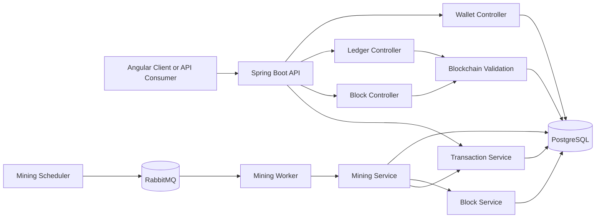
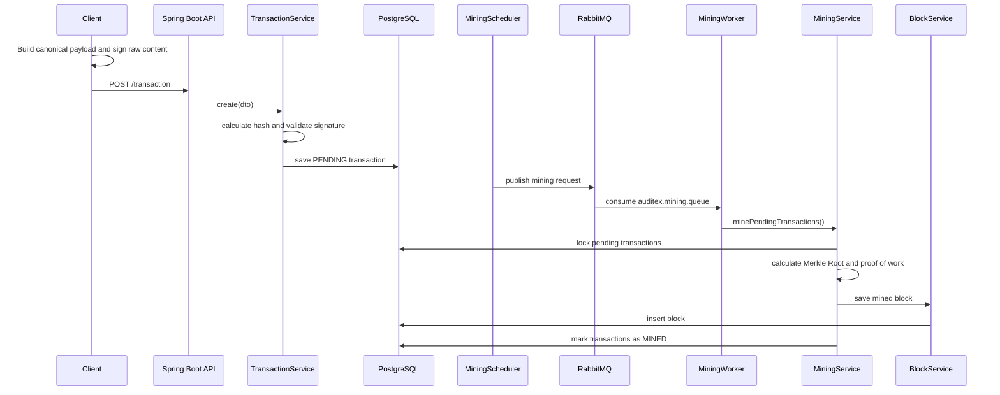
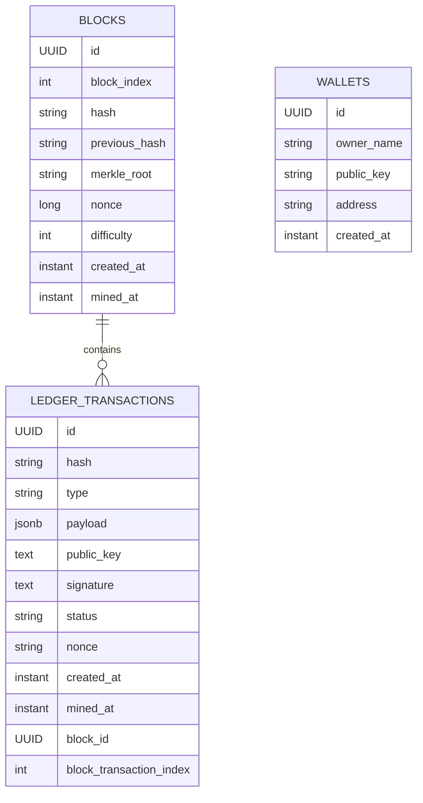

# Auditex — Ledger Financeiro Auditável

Auditex é um backend Spring Boot para um ledger financeiro auditável construído como uma blockchain centralizada e resistente a alterações silenciosas.

O sistema recebe eventos financeiros assinados, armazena esses eventos como transações de ledger, minera transações pendentes em blocos, calcula Merkle Roots, executa proof of work, valida a cadeia completa e expõe APIs para inspecionar transações, blocos, carteiras e saúde do ledger. O PostgreSQL é usado para persistência durável, incluindo payloads JSONB, e o RabbitMQ conduz o pipeline assíncrono de mineração.

O projeto não é uma criptomoeda e não se apresenta como blockchain descentralizada. Ele modela uma trilha de auditoria financeira em que um backend confiável mantém um ledger append-only enquanto hashes criptográficos, assinaturas, Merkle Trees, links por `previousHash` e validação completa tornam alterações silenciosas detectáveis.

## Por Que Este Projeto Existe

Sistemas financeiros precisam de trilhas de auditoria duráveis e inspecionáveis para eventos como arquivos recebidos, processamento de lotes, cálculo de cobranças, divergências, aprovações, rejeições, exportações e outras transições críticas de workflow.

Tabelas tradicionais de auditoria são úteis, mas podem ser difíceis de verificar posteriormente caso linhas históricas sejam alteradas diretamente. O Auditex resolve esse problema transformando eventos de workflow financeiro em transações assinadas e agrupando essas transações em blocos tamper-evident. Qualquer alteração em uma transação minerada, metadados de bloco, Merkle Root, hash de proof of work ou link de bloco anterior é detectável pela API de validação.

## Funcionalidades Principais

| Área | Capacidade implementada |
| --- | --- |
| Ingestão de transações | `POST /transaction` aceita payloads de eventos assinados com `type`, `payload`, `publicKey`, `signature` e `nonce`. |
| Modelo de assinatura | Verificação RSA `SHA256withRSA` usando a chave pública enviada. |
| Proteção contra replay | Restrição única `(public_key, nonce)` e checagens de validação. |
| Hash de transação | SHA-256 sobre `type + canonicalPayload + publicKey + nonce`. |
| Payloads JSONB | Payloads de transação são persistidos como `jsonb` no PostgreSQL. |
| Filtros financeiros | Queries JSONB nativas para `payload ->> 'processingId'` e `payload ->> 'fileHash'`. |
| Mineração assíncrona | Um publisher agendado emite solicitações de mineração via RabbitMQ a cada 5 segundos após atraso inicial de 1 segundo. |
| Worker de mineração | `@RabbitListener` consome `auditex.mining.queue` e delega para `MiningService`. |
| Criação de blocos | Transações pendentes são bloqueadas com `FOR UPDATE SKIP LOCKED`, mineradas, vinculadas a um bloco e marcadas como `MINED`. |
| Merkle Root | Construída a partir dos hashes das transações, preservando ordem determinística no bloco. |
| Proof of work | O hash SHA-256 do bloco deve começar com `difficulty` zeros. A dificuldade padrão atual é `4`. |
| Política de lote | Até 100 transações pendentes por bloco; lotes menores são minerados quando transações pendentes passam de 15 segundos. |
| Validação determinística | `blockTransactionIndex` preserva a ordem das transações para recomputar a Merkle Root. |
| Validação completa da cadeia | Verifica índices de blocos, hashes anteriores, Merkle Roots, hashes de blocos, proof of work, hashes de transações, assinaturas, status, vínculos de bloco, timestamps de mineração, índices de transação e nonces duplicados. |
| APIs paginadas | APIs de transações, blocos e transações por bloco são paginadas com tamanho máximo 100. |
| Guardas de imutabilidade | Checks de ciclo de vida JPA rejeitam alterações em blocos e transações mineradas. |
| Suporte a carteiras | Backend gera pares de chaves RSA e endereços; o cliente Angular criptografa chaves privadas localmente. |
| Explorer frontend | Cliente Angular inclui dashboard, explorer de ledger, explorer de blocos, detalhe de transação, criação de eventos e fluxos de carteira. |

## Visão Geral da Arquitetura

O Auditex é organizado em módulos de domínio pequenos sob `dev.joaopdias.auditex.core`: `transaction`, `block`, `mining`, `ledger` e `wallet`. Hashing, assinatura, paginação, CORS, security, RabbitMQ e tratamento de exceções ficam em `shared` e `config`.



## Ciclo de Vida da Transação

1. Um cliente cria um payload de evento financeiro.
2. O payload é serializado em JSON canônico.
3. O conteúdo bruto é montado como `type + canonicalPayload + publicKey + nonce`.
4. O cliente assina o conteúdo bruto com sua chave privada.
5. O backend valida a assinatura usando a chave pública enviada.
6. O backend calcula o hash da transação a partir do mesmo conteúdo bruto.
7. A transação é armazenada como `PENDING`.
8. `MiningScheduler` publica uma solicitação de mineração no RabbitMQ.
9. `MiningWorker` consome a mensagem e chama `minePendingTransactions()`.
10. `MiningService` seleciona transações pendentes com `FOR UPDATE SKIP LOCKED`.
11. A Merkle Root é calculada a partir dos hashes ordenados das transações.
12. O proof of work procura um nonce válido para o bloco.
13. O bloco é salvo.
14. As transações são marcadas como `MINED`.
15. `blockId`, `minedAt` e `blockTransactionIndex` são atribuídos.
16. `/ledger/validate` ou `/block/validate` pode verificar a integridade da cadeia.



## Validação da Blockchain

O fluxo de validação percorre blocos paginados ordenados por índice e as transações de cada bloco ordenadas por `blockTransactionIndex`. Ele não depende de `findAll()` em memória para validações críticas.

A validação verifica:

- sequência de índices de bloco começando em `0`;
- encadeamento por `previousHash`, usando hash anterior de gênese com 64 zeros no primeiro bloco;
- Merkle Root recalculada a partir dos hashes reais das transações persistidas;
- hash do bloco recalculado de `index + previousHash + merkleRoot + nonce + difficulty`;
- alvo de proof of work baseado em zeros à esquerda;
- status da transação deve ser `MINED`;
- `blockId` deve existir e corresponder ao bloco validado;
- `minedAt` deve existir;
- `blockTransactionIndex` deve existir;
- hash da transação deve corresponder a `type + canonicalPayload + publicKey + nonce`;
- assinatura RSA deve validar contra o conteúdo bruto reconstruído;
- uso duplicado de nonce por chave pública é detectado.

Exemplo de resposta:

```json
{
  "valid": true,
  "blocksChecked": 2,
  "transactionsChecked": 4,
  "brokenAtBlock": null,
  "brokenAtTransaction": null,
  "reason": null
}
```

Valores conhecidos de `reason` incluem `INVALID_BLOCK_INDEX`, `INVALID_PREVIOUS_HASH`, `INVALID_MERKLE_ROOT`, `INVALID_BLOCK_HASH`, `INVALID_PROOF_OF_WORK`, `INVALID_TRANSACTION_STATUS`, `MISSING_TRANSACTION_BLOCK_ID`, `INVALID_TRANSACTION_BLOCK_ID`, `MISSING_TRANSACTION_MINED_AT`, `MISSING_TRANSACTION_BLOCK_INDEX`, `INVALID_TRANSACTION_HASH`, `INVALID_TRANSACTION_SIGNATURE` e `DUPLICATED_TRANSACTION_NONCE`.

## Modelo de Domínio Financeiro

O backend aceita qualquer string em `type` e qualquer payload JSON. O cliente Angular modela os seguintes tipos de eventos financeiros:

| Tipo | Propósito |
| --- | --- |
| `BILLING_FILE_RECEIVED` | Registra a chegada de um arquivo de cobrança. |
| `BILLING_FILE_VALIDATED` | Registra o estado de validação do arquivo. |
| `BILLING_PROCESSING_STARTED` | Registra o início de um workflow de cobrança. |
| `BILLING_PROCESSING_FINISHED` | Registra métricas de conclusão de um workflow. |
| `BILLING_CHARGE_CALCULATED` | Registra valores de cobrança calculados. |
| `BILLING_DIVERGENCE_DETECTED` | Registra detalhes de divergência financeira ou por registro. |
| `BILLING_BATCH_APPROVED` | Registra aprovação de um lote processado. |
| `BILLING_BATCH_REJECTED` | Registra rejeição de um lote processado. |
| `BILLING_REPORT_EXPORTED` | Registra geração de relatório ou exportação. |

Os campos comuns do payload não são todos obrigatórios no backend. A API exige apenas `payload` não nulo; o frontend exige `processingId` e `fileHash` antes de enviar um evento financeiro.

| Campo | Significado |
| --- | --- |
| `processingId` | ID de correlação de um workflow de processamento. |
| `fileHash` | Hash do arquivo de origem ou gerado. |
| `fileName` | Nome legível do arquivo. |
| `recordsCount` | Quantidade de registros recebidos ou esperados. |
| `recordsProcessed` | Quantidade de registros processados. |
| `totalAmount` | Valor monetário total envolvido no evento. |
| `currency` | Código da moeda, por exemplo `BRL`. |
| `source` | Sistema ou pipeline de origem. |
| `divergenceType` | Categoria da divergência, por exemplo `AMOUNT_MISMATCH`. |
| `expectedAmount` | Valor monetário esperado. |
| `actualAmount` | Valor monetário observado. |
| `difference` | Diferença entre valor esperado e observado. |
| `affectedRecords` | Número de registros impactados. |
| `divergencesFound` | Quantidade de divergências encontradas no processamento. |
| `durationMs` | Duração do processamento em milissegundos. |
| `status` | Status de domínio como `COMPLETED`, `APPROVED`, `REJECTED` ou `EXPORTED`. |

## Modelo de Dados



### Block

| Campo | Observações |
| --- | --- |
| `id` | Chave primária UUID. |
| `index` | Armazenado como `block_index`; número sequencial único do bloco. |
| `hash` | Hash SHA-256 único do bloco. |
| `previousHash` | Hash do bloco anterior; o hash anterior de gênese tem 64 zeros. |
| `merkleRoot` | Merkle Root derivada dos hashes das transações. |
| `nonce` | Nonce do proof of work. |
| `difficulty` | Número de zeros à esquerda exigidos no hash do bloco. |
| `createdAt` | Definido ao persistir. |
| `minedAt` | Definido quando o bloco é salvo como minerado. |

### LedgerTransaction

| Campo | Observações |
| --- | --- |
| `id` | Chave primária UUID. |
| `hash` | Hash SHA-256 único da transação. |
| `type` | String do tipo de evento financeiro. |
| `payload` | Payload JSONB no PostgreSQL. |
| `publicKey` | Chave pública RSA em Base64. |
| `signature` | Assinatura RSA em Base64. |
| `status` | `PENDING`, `PROCESSING`, `VALIDATED`, `REJECTED` ou `MINED`; a mineração atualmente usa `PENDING`, `PROCESSING` e `MINED`. |
| `nonce` | Valor único por chave pública, gerado pelo cliente. |
| `createdAt` | Definido ao persistir. |
| `minedAt` | Definido quando a transação é minerada. |
| `blockId` | UUID do bloco que contém a transação. |
| `blockTransactionIndex` | Ordem determinística dentro do bloco. |

## Referência da API

Base URL local: `http://localhost:8080`.

Parâmetros de paginação:

| Parâmetro | Padrão | Limite |
| --- | --- | --- |
| `page` | `0` | deve ser `>= 0` |
| `size` | `20` para listagens, `50` para transações de bloco | máximo `100` |

### Transações

| Método | Path | Objetivo |
| --- | --- | --- |
| `POST` | `/transaction` | Criar uma transação de ledger assinada. |
| `GET` | `/transaction?page=0&size=20` | Listar transações, mais recentes primeiro. |
| `GET` | `/transaction/{hash}` | Buscar por hash. |
| `GET` | `/transaction/hash/{hash}` | Busca explícita por hash. |
| `GET` | `/transaction/public-key?publicKey=...&page=0&size=20` | Filtrar por chave pública. |
| `GET` | `/transaction/type/{type}?page=0&size=20` | Filtrar por tipo de evento. |
| `GET` | `/transaction/processing/{processingId}?page=0&size=20` | Filtrar por `payload.processingId` usando JSONB. |
| `GET` | `/transaction/file/{fileHash}?page=0&size=20` | Filtrar por `payload.fileHash` usando JSONB. |

Request de criação:

```json
{
  "type": "BILLING_FILE_RECEIVED",
  "payload": {
    "processingId": "ec8a7cd7-bac5-49cb-8a0f-d99102cd3b9f",
    "fileName": "billing_2026_05.csv",
    "fileHash": "sha256-do-arquivo",
    "recordsCount": 120000,
    "totalAmount": 1250000.75,
    "currency": "BRL",
    "source": "billing-pipeline"
  },
  "publicKey": "base64-x509-rsa-public-key",
  "signature": "base64-rsa-signature",
  "nonce": "6cf4c86b-5a92-4b96-873b-fc63df83efc7"
}
```

Resposta de criação:

```json
{
  "id": "c070149b-43fd-4d0a-a33f-83278e25e03b",
  "hash": "9b5f7b8e6dc6a9cbcd3dd79c3f9cf0668b0dbb2b25e04f25e3d91fa31b3c7a60",
  "type": "BILLING_FILE_RECEIVED",
  "payload": {
    "processingId": "ec8a7cd7-bac5-49cb-8a0f-d99102cd3b9f",
    "fileName": "billing_2026_05.csv",
    "fileHash": "sha256-do-arquivo",
    "recordsCount": 120000,
    "totalAmount": 1250000.75,
    "currency": "BRL",
    "source": "billing-pipeline"
  },
  "publicKey": "base64-x509-rsa-public-key",
  "signature": "base64-rsa-signature",
  "status": "PENDING",
  "nonce": "6cf4c86b-5a92-4b96-873b-fc63df83efc7",
  "createdAt": "2026-05-12T12:00:00Z",
  "minedAt": null,
  "blockId": null,
  "blockTransactionIndex": null
}
```

Formato de resposta paginada:

```json
{
  "content": [],
  "page": 0,
  "size": 20,
  "totalElements": 0,
  "totalPages": 0,
  "first": true,
  "last": true
}
```

### Blocos

| Método | Path | Objetivo |
| --- | --- | --- |
| `GET` | `/block?page=0&size=20` | Listar blocos ordenados por índice crescente. |
| `GET` | `/block/validate` | Validar a blockchain. |
| `GET` | `/block/latest` | Retornar o bloco mais recente. |
| `GET` | `/block/last` | Alias para o bloco mais recente. |
| `GET` | `/block/id/{id}` | Buscar bloco por UUID. |
| `GET` | `/block/hash/{hash}` | Buscar bloco por hash. |
| `GET` | `/block/index/{index}` | Buscar bloco por índice. |
| `GET` | `/block/{id}/transaction?page=0&size=50` | Retornar um bloco e suas transações paginadas. |
| `GET` | `/block/{hash}` | Buscar bloco por hash. |

Resposta de bloco:

```json
{
  "id": "88c4fb49-43ec-4b38-8d9a-4d5ad3283a1a",
  "index": 0,
  "hash": "0000c33a4c6edb2460b8782d5e9e5bdf4f6c6a49560a25d4a72ffdf6f82d95a1",
  "previousHash": "0000000000000000000000000000000000000000000000000000000000000000",
  "merkleRoot": "9b5f7b8e6dc6a9cbcd3dd79c3f9cf0668b0dbb2b25e04f25e3d91fa31b3c7a60",
  "nonce": 49728,
  "difficulty": 4,
  "createdAt": "2026-05-12T12:00:30Z",
  "minedAt": "2026-05-12T12:00:30Z",
  "transactionsCount": 1
}
```

### Ledger

| Método | Path | Objetivo |
| --- | --- | --- |
| `GET` | `/ledger/status` | Agregar status do ledger e metadados do último bloco. |
| `GET` | `/ledger/validate` | Validar a blockchain pela fachada de ledger. |

Resposta de status:

```json
{
  "valid": true,
  "blocksCount": 12,
  "pendingTransactions": 1,
  "minedTransactions": 842,
  "latestBlockIndex": 11,
  "latestBlockHash": "0000e72a5d4d0b1f5e9f5b95e7c4c75d62a7f1d6f7bd297d26894683e4f5a111",
  "lastMinedAt": "2026-05-12T12:15:00Z"
}
```

### Carteiras

| Método | Path | Objetivo |
| --- | --- | --- |
| `POST` | `/wallet` | Gerar uma carteira RSA e persistir sua identidade pública. |

Request:

```json
{
  "ownerName": "Finance Ops"
}
```

Resposta:

```json
{
  "id": "f33af0f4-f27a-49e6-b510-40573dfc3127",
  "ownerName": "Finance Ops",
  "address": "AX-2e2c0efb1c63a1a02d0a54694c7b4c67",
  "publicKey": "base64-x509-rsa-public-key",
  "privateKey": "base64-pkcs8-rsa-private-key",
  "createdAt": "2026-05-12T12:00:00Z"
}
```

O backend retorna a chave privada apenas no momento de criação. O cliente Angular criptografa essa chave localmente usando PBKDF2 e AES-GCM antes de armazená-la no IndexedDB.

## Exemplos de Payloads Financeiros

`BILLING_FILE_RECEIVED`:

```json
{
  "processingId": "ec8a7cd7-bac5-49cb-8a0f-d99102cd3b9f",
  "fileName": "billing_2026_05.csv",
  "fileHash": "sha256-do-arquivo",
  "recordsCount": 120000,
  "totalAmount": 1250000.75,
  "currency": "BRL",
  "source": "billing-pipeline"
}
```

`BILLING_DIVERGENCE_DETECTED`:

```json
{
  "processingId": "ec8a7cd7-bac5-49cb-8a0f-d99102cd3b9f",
  "fileHash": "sha256-do-arquivo",
  "divergenceType": "AMOUNT_MISMATCH",
  "expectedAmount": 1250000.75,
  "actualAmount": 1249980.5,
  "difference": 20.25,
  "affectedRecords": 3
}
```

## Stack Técnico

Backend:

- Java 25
- Spring Boot 4.0.6
- Spring Web MVC
- Spring Data JPA / Hibernate
- Spring Security com configuração permissiva de desenvolvimento
- Spring Validation
- Spring AMQP
- PostgreSQL 17
- Imagem RabbitMQ 4 com management
- Maven wrapper
- Docker e Docker Compose
- JUnit, Mockito, Spring MVC Test, Spring AMQP Test, Spring Data JPA Test

Frontend:

- Angular 21
- TypeScript 5.9
- RxJS
- SCSS
- Vitest pelo builder de testes unitários do Angular
- Vault de carteira em IndexedDB
- Web Crypto API para criptografia local de chave privada e assinatura de transações

## Setup Local

### Requisitos

- Java 25
- Docker e Docker Compose
- Dependências do Maven wrapper, baixadas automaticamente pelo `mvnw`
- Node.js/Yarn para executar o cliente Angular

### Backend com PostgreSQL e RabbitMQ locais

Suba a infraestrutura:

```bash
docker compose up -d db message-br
```

Execute o backend:

```bash
bash ./mvnw spring-boot:run
```

A API roda em `http://localhost:8080`.

O RabbitMQ Management roda em `http://localhost:15672` com usuário `user` e senha `user`.

### Docker Compose Completo

O compose consegue construir a imagem do servidor:

```bash
docker compose up --build
```

Observação sobre o compose atual: o serviço `server` define variáveis do PostgreSQL, mas ainda não define `RABBITMQ_HOST=message-br` nem aguarda o serviço RabbitMQ. Para rodar backend + RabbitMQ totalmente em containers, adicione estes valores ao ambiente do `server`:

```yaml
RABBITMQ_HOST: message-br
RABBITMQ_PORT: 5672
RABBITMQ_USERNAME: user
RABBITMQ_PASSWORD: user
```

### Frontend

A partir do diretório irmão do repositório:

```bash
cd ../client
yarn install
yarn start
```

O app Angular roda em `http://localhost:4200` e usa `http://localhost:8080` como `API_URL` na configuração de desenvolvimento.

## Variáveis de Ambiente

| Variável | Padrão | Uso |
| --- | --- | --- |
| `PORT` | `8080` | Porta do servidor Spring via `server.port=${PORT:8080}`. |
| `DATABASE_URL` | `jdbc:postgresql://localhost:5432/auditex` | URL JDBC. |
| `DATABASE_USERNAME` | `postgres` | Usuário do banco. |
| `DATABASE_PASSWORD` | `postgres` | Senha do banco. |
| `JPA_DDL_AUTO` | `update` | Modo de schema do Hibernate. |
| `JPA_SHOW_SQL` | `true` | Log de SQL. |
| `JPA_FORMAT_SQL` | `true` | Formatação de SQL. |
| `SQL_INIT_MODE` | `never` | Modo de inicialização SQL do Spring. |
| `RABBITMQ_HOST` | `localhost` | Host do RabbitMQ. |
| `RABBITMQ_PORT` | `5672` | Porta do RabbitMQ. |
| `RABBITMQ_USERNAME` | `user` | Usuário do RabbitMQ. |
| `RABBITMQ_PASSWORD` | `user` | Senha do RabbitMQ. |
| `RABBITMQ_RETRY_ENABLED` | `true` | Habilita retry do listener. |
| `RABBITMQ_RETRY_INITIAL_INTERVAL` | `1000` | Intervalo inicial de retry. |
| `RABBITMQ_RETRY_MAX_ATTEMPTS` | `3` | Número máximo de tentativas. |
| `RABBITMQ_RETRY_MAX_INTERVAL` | `10000` | Intervalo máximo de retry. |
| `RABBITMQ_RETRY_MULTIPLIER` | `2` | Multiplicador de retry. |
| `CLIENT_URLS` | `http://localhost:4200` | Origens CORS permitidas, separadas por ponto e vírgula. |

O compose também define `SERVER_PORT`, mas a aplicação atualmente lê `PORT`.

## Testes

Backend:

```bash
bash ./mvnw test
```

A suíte atual do backend cobre:

- criação de transação, detecção de hash duplicado, detecção de nonce duplicado, assinaturas inválidas, busca por hash e validação de paginação;
- filtros JSONB de repositório por `processingId` e `fileHash`;
- política de lote da mineração, mineração com Merkle Root, comportamento de proof of work e transições de estado das transações;
- scheduler de mineração e delegação do worker RabbitMQ;
- criação de bloco, paginação, busca, listagem de transações do bloco e modos de falha da validação completa da cadeia;
- status do ledger e fachada de validação;
- criação de carteira e geração de chaves RSA;
- serviços de hash e assinatura;
- mapeamento global de exceções;
- guardas de imutabilidade das entidades.

Frontend:

```bash
cd ../client
yarn test
```

O projeto Angular usa o builder de testes unitários do Angular com Vitest.

## Decisões de Design

**Blockchain centralizada.** O Auditex usa estruturas de dados de blockchain sem se apresentar como descentralizado. Uma plataforma financeira pode manter controle operacional e ainda tornar mutações históricas evidentes por meio de hashes, assinaturas, Merkle Roots e validação da cadeia.

**Pipeline de mineração com RabbitMQ.** A ingestão de transações permanece rápida: ela valida e armazena eventos como `PENDING`. A mineração é disparada assincronamente por mensagens RabbitMQ agendadas e processada por um worker.

**Mineração assíncrona em lotes.** Blocos são minerados quando existem ao menos 100 transações pendentes ou quando lotes menores passam de 15 segundos. Isso equilibra latência e densidade dos blocos.

**Merkle Root por bloco.** O bloco se compromete com o conjunto de transações sem colocar todos os dados das transações no hash do bloco. A validação consegue recomputar a raiz a partir das transações persistidas.

**`blockTransactionIndex`.** A Merkle Root depende da ordem das transações, então a ordem minerada é persistida explicitamente e restringida como única por bloco.

**Validação completa da cadeia.** A validação verifica integridade em nível de bloco e de transação, não apenas links por hash anterior.

**Persistência com PostgreSQL.** PostgreSQL fornece constraints relacionais duráveis, armazenamento JSONB, filtros JSONB nativos e lock de linha com `FOR UPDATE SKIP LOCKED`.

**Acesso paginado.** Fluxos de blocos, transações e validação evitam carregar o ledger inteiro em memória. APIs públicas de listagem impõem tamanho máximo de página 100.

## Modelo de Segurança e Integridade

- O backend valida assinaturas com `publicKey`; a assinatura da transação é feita pelo cliente.
- A API de transações nunca aceita `privateKey`; ela recebe apenas chave pública, assinatura, nonce, tipo e payload.
- O endpoint de carteira do backend atualmente gera e retorna uma chave privada apenas no momento de criação da carteira.
- O cliente Angular armazena chaves privadas localmente depois de criptografá-las com chaves AES-GCM derivadas por PBKDF2 no IndexedDB.
- Nonces de transação evitam replay para a mesma chave pública por meio de constraint única no banco.
- Hashes de transação detectam alteração de tipo, payload, chave pública ou nonce.
- Merkle Roots detectam alteração de transações dentro de um bloco minerado.
- Links por `previousHash` conectam blocos em cadeia.
- Proof of work torna alterações retroativas detectáveis porque um bloco modificado ainda precisa satisfazer o alvo configurado.
- Guardas de ciclo de vida JPA rejeitam alterações em blocos e transações mineradas pelos fluxos normais de persistência.
- `/ledger/validate` e `/block/validate` recomputam a integridade da cadeia a partir dos dados persistidos.

Nota de desenvolvimento: `SecurityConfig` atualmente permite todas as requisições e desabilita CSRF, o que é adequado para uma API de portfólio/demo, mas deve ser endurecido antes de uso em produção.

## Considerações de Performance e Escalabilidade

- APIs públicas de listagem são paginadas.
- A validação percorre blocos e transações por páginas.
- A mineração processa lotes de até 100 transações.
- `FOR UPDATE SKIP LOCKED` evita que workers concorrentes selecionem as mesmas linhas pendentes.
- Existem índices de banco para status da transação, status + data de criação, ID do bloco, ID do bloco + índice da transação, chave pública e chave pública + data de criação.
- Constraints únicas protegem hash de transação, `(public_key, nonce)`, hash do bloco, índice do bloco e `(block_id, block_transaction_index)`.
- Filtros JSONB dão suporte a consultas orientadas a workflow por `processingId` e `fileHash`.
- Fluxos críticos evitam uso não limitado de `findAll()`.

## Estrutura do Projeto

```text
server
├── compose.yaml
├── Dockerfile
├── pom.xml
├── src/main/java/dev/joaopdias/auditex
│   ├── AuditexApplication.java
│   ├── config
│   │   ├── CorsConfig.java
│   │   ├── RabbitMessageConfig.java
│   │   ├── RabbitMqConfig.java
│   │   ├── RabbitTemplateConfig.java
│   │   └── SecurityConfig.java
│   ├── core
│   │   ├── block
│   │   ├── ledger
│   │   ├── mining
│   │   ├── transaction
│   │   └── wallet
│   └── shared
│       ├── dto
│       ├── exceptions
│       └── services
└── src/test/java/dev/joaopdias/auditex
    ├── config
    ├── core
    └── shared

client
└── src/app
    ├── core
    ├── features
    │   ├── block
    │   ├── dashboard
    │   ├── ledger
    │   ├── transaction
    │   └── wallet
    └── shared
```

## Portfolio Highlights

- Arquitetura backend orientada a eventos com RabbitMQ.
- Modelagem de domínio de auditoria financeira com campos de correlação de workflow.
- Validação criptográfica de assinaturas com RSA.
- Estruturas de dados tamper-evident no estilo blockchain.
- Verificações de integridade com Merkle Tree.
- Mineração de blocos com proof of work.
- Persistência PostgreSQL com JSONB e filtros de consulta.
- Validação completa da cadeia em blocos e transações.
- Acesso paginado a dados e loops de validação.
- Design de API baseado em DTOs.
- Dashboard/explorer Angular e vault local de carteira.

## Roadmap

Trabalhos futuros que se encaixam na arquitetura atual:

- Endpoint de Merkle proof para uma transação dentro de um bloco.
- Validação de schema mais rica por tipo de evento financeiro.
- Exportação de relatórios de auditoria.
- UI administrativa de explorer com diagnósticos mais profundos de blocos e validação.
- Configuração de dead-letter queue para mensagens de mineração com falha.
- Lock distribuído ou single-flight guard para coordenar mineração com múltiplas instâncias.
- Regras explícitas de banco append-only e gerenciamento de schema por migrations.
- Integração com Testcontainers para testes de integração com PostgreSQL e RabbitMQ.
- Observabilidade de produção com métricas, logs estruturados e tracing.
- Autenticação e autorização robustas para operações de carteira, ledger e administração.
